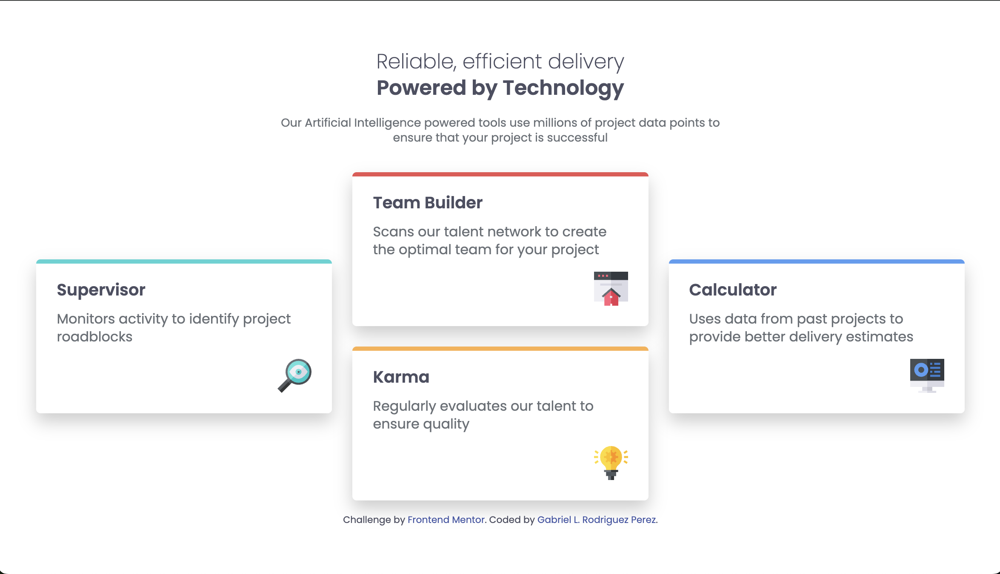

# Frontend Mentor - Four card feature section solution

This is a solution to the [Four card feature section challenge on Frontend Mentor](https://www.frontendmentor.io/challenges/four-card-feature-section-weK1eFYK). Frontend Mentor challenges help you improve your coding skills by building realistic projects.

## Table of contents

- [Overview](#overview)
  - [The challenge](#the-challenge)
  - [Screenshot](#screenshot)
  - [Links](#links)
- [My process](#my-process)
  - [Built with](#built-with)
  - [What I learned](#what-i-learned)
  - [Continued development](#continued-development)
  - [Useful resources](#useful-resources)
- [Author](#author)

## Overview

### The challenge

Users should be able to:

- View the optimal layout for the site depending on their device's screen size

### Screenshot



### Links

- Solution URL: [Four Card Feature Solution](https://github.com/glrodriperez98/four-card-feature-section)
- Live Site URL: [Four Card Feature Live](https://glrodriperez98.github.io/four-card-feature-section/)

## My process

### Built with

- Semantic HTML5 markup
- CSS custom properties
- CSS Grid
- Media Queries
- Mobile-first workflow

### What I learned

This was the first time I truly used **CSS Grid** in a project, and it completely changed how I think about layout. I learned how to span rows and columns, and how powerful grid positioning can be for complex layouts like this.

I also gained a much better understanding of **media queries**. Before this, I struggled with responsive layouts, but during this challenge I really started to understand how to use breakpoints effectively to make designs work across different screen sizes.

Here is a small code snippet that helped me understand how to center cards in a multi-column layout:

```
css
.card-grid {
  display: grid;
  grid-template-columns: repeat(3, 1fr);
  grid-template-rows: auto auto;
  align-items: start;
}

.supervisor {
  grid-row: 1 / 3;
  align-self: center;
}

.calculator {
  grid-row: 1 / 3;
  align-self: center;
}
```

### Continued development

I want to continue working with **CSS Grid** in future projects, especially using `grid-template-areas` and nested grids. I'd also like to keep improving at making mobile-first layouts that feel just as polished on small screens as on large ones.

### Useful resources

- [Kevin Powell - Learn CSS Grid the easy way](https://www.youtube.com/watch?v=rg7Fvvl3taU) - This video helped me unlock CSS Grid. Kevin breaks everything down in a way that just clicked for me.
- [MDN Web Docs - CSS Grid Layout](https://developer.mozilla.org/en-US/docs/Web/CSS/CSS_grid_layout) - A must go-to reference when unsure about CSS Grid properties.

## Author

- Frontend Mentor - [@glrodriperez98](https://www.frontendmentor.io/profile/glrodriperez98)
- GitHub - [glrodriperez](https://github.com/glrodriperez98)
